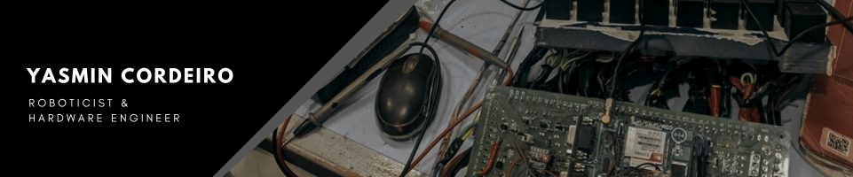

### 
 👋 Hi there! I'm Yasmin, welcome to my profile 🇧🇷 

   

- 🎓 Currently studying **Computer Engineering** at UEFS.
  
- 💻 FAPESB scholarship holder conducting research in **robotics**.

- 📚 Interested in robotics, embedded systems, and hardware engineering.

- 📢 **Student representative** on the Computer Engineering board.

- 💜 Founding member of **IEEE Women in Engineering** at UEFS.

- 🌱  Forever an **IEEE volunteer**.

- ✨ **Pronouns:** She/Her

 

<!--
**yasmincsme/yasmincsme** is a ✨ _special_ ✨ repository because its `README.md` (this file) appears on your GitHub profile.

Here are some ideas to get you started:

- 🔭 I’m currently working on ...
- 🌱 I’m currently learning ...
- 👯 I’m looking to collaborate on ...
- 🤔 I’m looking for help with ...
- 💬 Ask me about ...
- 📫 How to reach me: ...
- 😄 Pronouns: ...
- ⚡ Fun fact: ...
-->
